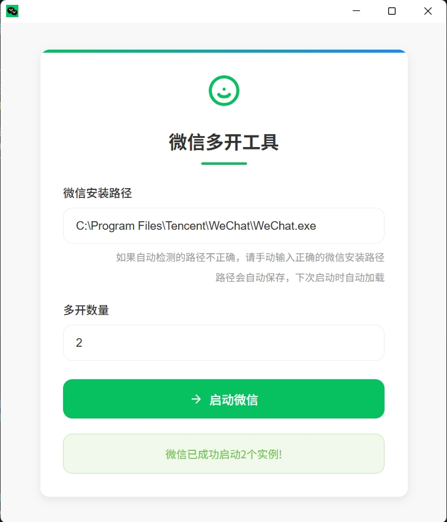

# 微信多开工具

这是一个简单的微信多开工具，可以通过Web界面选择微信程序文件并启动多个微信实例。

## 功能特点

- 美观的Web界面
- 支持选择微信程序文件
- 可自定义多开数量（1-3个）
- 简单易用的操作方式

## 使用方法

1. 双击运行 `wechat-multi-open.exe`
2. 在打开的Web界面中，输入微信程序文件路径（WeChat.exe）
3. 输入想要启动的微信实例数量（1-3之间）
4. 点击"启动微信"按钮
5. 等待程序启动多个微信实例
6. 用不同的微信账号进行扫描即可实现登录多个微信！





## 注意事项

- 请确保选择的微信程序文件是有效的
- 多开数量建议不要超过3个，以免影响系统性能（避免微信风控封号）
- 如果遇到问题，请检查微信程序文件路径是否正确

## 技术说明

- 使用Python Flask框架开发
- 使用PyInstaller打包成单个exe文件
- 支持Windows系统 

## 本地调试

```bash
# 安装依赖
pip install -r requirements.txt -i https://mirrors.aliyun.com/pypi/simple

# 运行程序
python main.py
```


